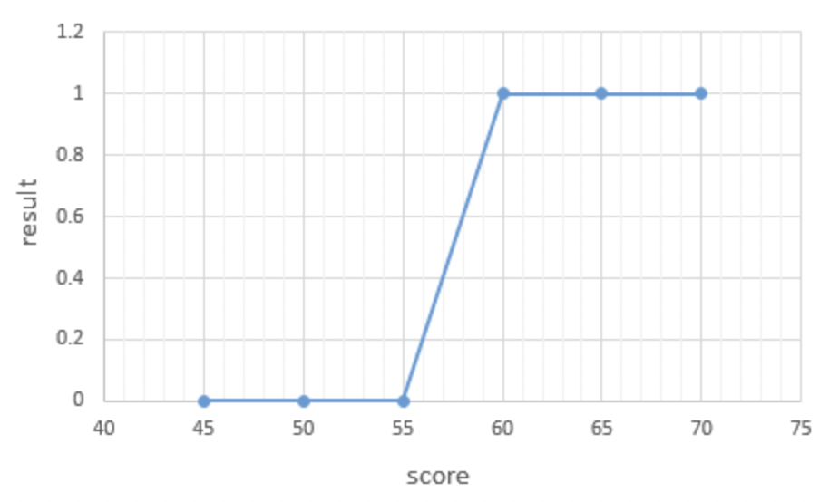
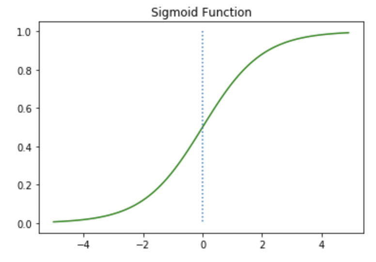

## Logistic Regression 

일상 속 풀고자하는 많은 문제 중에서는 **두 개의 선택지** 중에서 정답을 고르는 문제가 많습니다. 예를 들어 시험을 봤는데 이 시험 점수가 합격인지 불합격인지가 궁금할 수도 있고, 어떤 메일을 받았을 때 이게 정상 메일인지 스팸 메일인지를 분류하는 문제도 그렇습니다. 이렇게 둘 중 하나를 결정하는 문제를 **이진 분류(Binary Classification)**라고 합니다. 그리고 이진 분류를 풀기 위한 대표적인 알고리즘으로 **로지스틱 회귀(Logistic Regression)**가 있습니다.

로지스틱 회귀는 알고리즘의 이름은 회귀이지만 실제로는 **분류(Classification)** 작업에 사용할 수 있습니다.

즉, Logistic regression 은 binary classification 문제를 풀기 위한 알고리즘이다. 

  
위의 그림과 같이, binary classification 의 경우엔 직선으로 표현하기 매우 힘든 상황이다.  
때문에 S 자의 모습을 갖는 것을 필요로 한다.  

### Sigmoid function  
`H(x) = *sigmoid*(Wx + b) = 1 / 1 + e^-(Wx + b)`  
로 표현되는 sigmoid function 은  

의 형태를 갖는다. 
